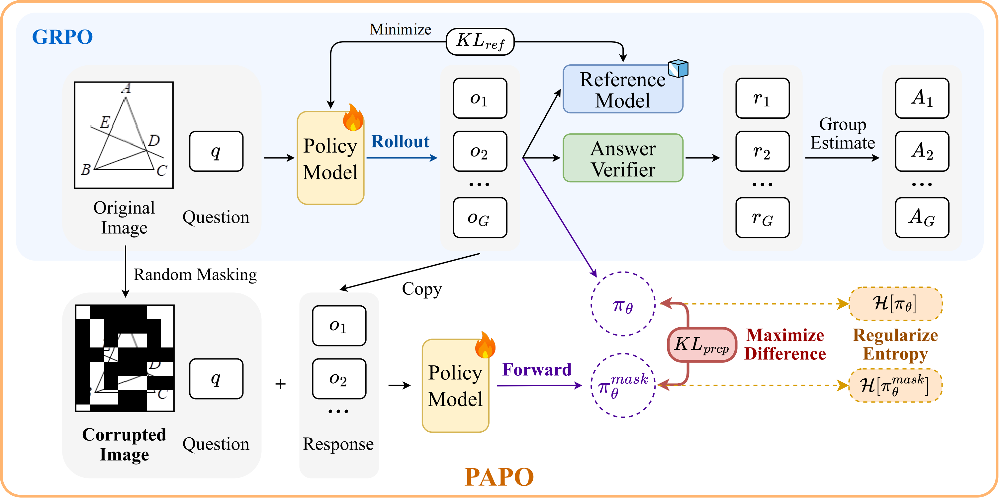
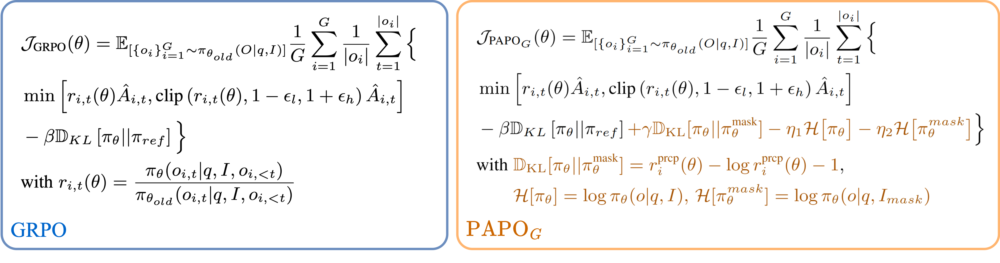
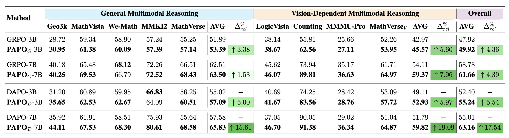

<div align="center">

# **PAPO: Perception-Aware Policy Optimization for Multimodal Reasoning (ICLR 2026)**

</div>

<div align="center">

[](https://mikewangwzhl.github.io/PAPO)
[](https://arxiv.org/abs/2507.06448)
[](https://github.com/mikewangwzhl/PAPO)
[](https://huggingface.co/collections/PAPOGalaxy/papo-qwen-686d92dd3d43b1ce698f851a)
[](https://huggingface.co/collections/PAPOGalaxy/data-686da53d67664506f652774f)

</div>

**This branch contains the implementation and enviroment for training only the Qwen3 family with PAPO. Qwen3 requires a different env than Qwen2.5-VL, so please refer to the [main](https://github.com/MikeWangWZHL/PAPO/tree/main) for instructions on running PAPO with Qwen2.5-VL.**

**PAPO**, a novel policy gradient algorithm that enhances multimodal reasoning through visually grounded optimization. PAPO can serve as a direct drop-in replacement for GRPO or DAPO without any additional assumptions.

## 🔥 News 
- **Jan 2026:** PAPO is accepted to ICLR 2026, release qwen3 training code
- [x] **July 2025:** Released PAPO_G (GRPO) models
- [x] **July 2025:** Released PAPO_G (GRPO) code
- [x] **August 2025:** Released PAPO_D (DAPO) models
- [x] **August 2025:** Released PAPO_D (DAPO) code

## 🌟 **Key Highlights**

- **4.4%-17.5% overall improvement** on diverse multimodal benchmarks
- **8.0%-19.1% improvement** on tasks high vision-dependentcy  
- **30.5% reduction** in perception errors
- **No additional data or external reward models** required
- Serves as a **direct drop-in replacement** for GRPO and DAPO

## 📖 **Methodology**

### **Perception Bottleneck**

We identified that **67% of errors** in current multimodal reasoning models stem from poor perception rather than logical reasoning failures.

<div align="center">

</div>

### **PAPO Algorithm**

**PAPO** extends GRPO/DAPO by adding an **Implicit Perception Loss** that maximizes the KL divergence between model outputs on original vs. corrupted (masked) images:

<div align="center">

</div>

The core intuition is that a well-behaved multimodal model should produce significantly different outputs when visual information is corrupted, indicating reliance on meaningful visual content. To further enhance training stability, we introduce Double Entropy Loss, an effective regularizer that prevents model collapse while preserving performance.

<div align="center">

</div>

### **Main Results**

PAPO consistently outperforms GRPO/DAPO across diverse benchmarks, with particularly pronounced improvements on vision-dependent tasks:

<div align="center">

</div>


## 📊 **Data**

We adapt multiple multimodel reasoning benchmarks to construct our training and evaluation datasets.

### **Training Data**

- **Training**: We adapt [TIGER-Lab/ViRL39K](https://huggingface.co/datasets/TIGER-Lab/ViRL39K) for training. The processed dataset can be found at: [PAPOGalaxy/PAPO_ViRL39K_train](https://huggingface.co/datasets/PAPOGalaxy/PAPO_ViRL39K_train).
- Validation (optional): We use the testset from [MMK12](https://huggingface.co/datasets/FanqingM/MMK12) for validation during training. **Note that this is solely for monitoring, we do not pick checkpoints based on this.** The processed dataset can be found [PAPOGalaxy/PAPO_MMK12_test](https://huggingface.co/datasets/PAPOGalaxy/PAPO_MMK12_test).

### **Evaluation Data**
We adapted 8 different multimodal reasoning benchmarks to evaluate **PAPO**, which are further identify two groups, including `General Multimodal Reasoning` and `Vision-Dependent Multimodal Reasoning`.
All evaluation benchmarks can be found in https://huggingface.co/datasets/PAPO-Galaxy/PAPO_eval.
For MathVista and MathVerse, we filter out instances with free-form answers to ensure verifiable evaluation and to avoid relying on LLM-as-a-judge.
<!-- - **General Reasoning**
    - `hiyouga/geometry3k`: [Hugging Face Dataset](https://huggingface.co/datasets/hiyouga/geometry3k), [Data Source](https://github.com/lupantech/InterGPS)
    - `AI4Math/MathVista`: [Hugging Face Dataset](https://huggingface.co/datasets/AI4Math/MathVista)
    - `We-Math/We-Math`: [Hugging Face Dataset](https://huggingface.co/datasets/We-Math/We-Math)
    - `FanqingM/MMK12`: [Hugging Face Dataset](https://huggingface.co/datasets/FanqingM/MMK12)
    - `AI4Math/MathVerse`: [Hugging Face Dataset](https://huggingface.co/datasets/AI4Math/MathVerse)
- **Vision-Dependent Reasoning**
    - `lscpku/LogicVista`: [Hugging Face Dataset](https://huggingface.co/datasets/lscpku/LogicVista)
    - `BUAADreamer/clevr_count_70k`: [Hugging Face Dataset](https://huggingface.co/datasets/BUAADreamer/clevr_count_70k)
    - `MMMU/MMMU_Pro`: [Hugging Face Dataset](https://huggingface.co/datasets/MMMU/MMMU_Pro)
    - `MathVerse_V` (vision-dependent subset): Adapted from [AI4Math/MathVerse](https://huggingface.co/datasets/AI4Math/MathVerse) -->

All results in the paper are average accurarcy @ 8 (repeating 8 times), with a temperature set to 1.0.


## 🚀 **Quick Start (Qwen3-VL)**
Qwen3 needs higher cuda driver and compiler than 12.4. We use 12.8.
Consequently, we also update the following packages:
* transformers: 4.51.3 -> 4.57.1
* torch: 2.6.0+cu124 -> 2.8.0+cu128
* torchdata:  0.11.0 -> 0.10.0
* torch audio: 2.6.0+cu124 -> 2.8.0+cu128
* cuda wheels: cu124 -> cu128
* vllm: 0.8.4 -> 0.11.0

### Update Support for Qwen3-VL 
### **Environment Setup**

#### **Option 1: All-In-One Installation Script**
```bash
conda create -n papo python=3.12
conda activate papo

cd PAPO
bash install.sh
```

#### **Option 2: Using pip**
```bash
pip install -e .
pip install lazy_loader
pip install transformers==4.57.1

#upgrade torch with cuda 12.8 wheel
pip uninstall -y torch torchvision torchaudio torchdata
pip install \
  torch==2.8.0 \
  torchvision==0.23.0 \
  torchaudio==2.8.0 \
  torchdata==0.10.0 \
  --index-url https://download.pytorch.org/whl/cu128

#upgrade flash-attn with 12.8 wheel. Add your python wheel
pip install https://github.com/Dao-AILab/flash-attention/releases/download/v2.8.3/flash_attn-2.8.3+cu12torch2.8cxx11abiFALSE-cp312-cp312-linux_x86_64.whl

pip install vllm==0.11.0
```

### TROUBLE SHOOTING:
If you get 
```bash
No such file or directory: '<CONDA_PREFIX>/bin/x86_64-conda-linux-gnu-cc'
```

then run

```bash
conda install -y -c conda-forge compilers
```

verify that the installation worked by running:
```bash
ls -l "$CONDA_PREFIX/bin/x86_64-conda-linux-gnu-cc"
ls -l "$CONDA_PREFIX/bin/x86_64-conda-linux-gnu-c++"
```
if you get paths, then the problem is solved.

### **Training**

The main training pipeline is adopted from [EasyR1](https://github.com/hiyouga/EasyR1). We support `Qwen3-VL Thinking 2B`. Checkpoints for `Qwen3-VL Thinking 7B` coming soon.

- **Qwen3-VL 2B:** We typically use 4 `80G H100` GPUs

#### **GRPO Baseline**
```bash
# 2B model
cd PAPO
bash examples/papo_grpo/qwen3_vl_2b_grpo.sh

#### **PAPO-G (Config for Table 1 Results)**
```bash
# 2B model
cd PAPO
bash examples/papo_grpo/qwen3_vl_2b_grpo_papo.sh
```

Qwen3 by default trains with No Reference KL. 


### **Pretrained Checkpoints**
The checkpoint for Qwen3-VL-2b-Thinking can be found [here](https://huggingface.co/PAPOGalaxy/PAPO-G-Qwen3-VL-2B-Thinking). The checkpoints follows Qwen3-VL-Thinking Huggingface format, which can be inferenced as drop-in replacement to https://huggingface.co/Qwen/Qwen3-VL-2B-Thinking. All checkpoints are corresponding to the last step.

### **Merge Checkpoint in Hugging Face Format**
python scripts/model_merger.py --local_dir checkpoints/[EXP_NAME]/global_step_[STEP_NUMBER]/actor


### **Performance Evaluation**

To run model inference and evaluation, we integrate the evaluation submodule located at `PAPO/PAPO-Eval`.
Detailed instructions for running inference and evaluation can be found in [PAPO-Eval](https://github.com/xhguo7/PAPO-Eval).
```bash
# Navigate to PAPO evaluation submodule
cd PAPO-Eval

# Data preprocessing
bash papo_eval/preprocess/preprocess.sh

# Run model inference
bash papo_eval/run_infer.sh

# Run model evaluation
bash papo_eval/run_eval.sh
```

### **Additional Implementation Notes on Entropy Losses**
In theory, when enabling double entropy loss (adding `aug_entropy_loss` during the `workers/actor/dp_actor.py/update_policy`) we need to do an additional forward pass on the masked sequence to recompute the `aug_log_probs`. In practice, we find that whether doing this additional forward pass does not signiticantly affect the performance.
Thus, by default in current implementation, we skipped the recomputation, which still empirically brings slight improvement over single entropy. Detailed discussion can be found in https://github.com/MikeWangWZHL/PAPO/issues/20.
We also provide a switch `RECOMPUTE_AUG_LOG_PROBS` in `workers/actor/dp_actor.py` to turn on/off this recomputation if one requires the explicit impact on the graidents from the `aug_log_probs` (note that this will slow down training due to the additional forward pass). 


## 🥰 Acknowledgements

We thank the [EasyR1](https://github.com/hiyouga/EasyR1) team for providing the foundational codebase that we adapted to implement PAPO. Our implementation builds upon their efficient RLVR framework and extends it with perception-aware optimization methodologies. We also acknowledge the open-source community for providing the datasets and evaluation benchmarks that made this research possible.

## 📝 Citation

```bibtex
@article{wang2025perception,
  title={Perception-Aware Policy Optimization for Multimodal Reasoning},
  author={Wang, Zhenhailong and Guo, Xuehang and Stoica, Sofia and Xu, Haiyang and Wang, Hongru and Ha, Hyeonjeong and Chen, Xiusi and Chen, Yangyi and Yan, Ming and Huang, Fei and others},
  journal={arXiv preprint arXiv:2507.06448},
  year={2025}
}
```

## 📄 License

This project is licensed under the MIT License - see the [LICENSE](LICENSE) file for details.

---

<div align="center">

**Learning to perceive while learning to reason!**

[🌐 Project Page](https://mikewangwzhl.github.io/PAPO)  |  [📄 Paper](https://arxiv.org/abs/2507.06448)  |  [💻 GitHub](https://github.com/mikewangwzhl/PAPO)  |  [🤗 Models](https://huggingface.co/collections/PAPOGalaxy/papo-qwen-686d92dd3d43b1ce698f851a)  |  [🤗 Data](https://huggingface.co/collections/PAPOGalaxy/data-686da53d67664506f652774f)

</div>
